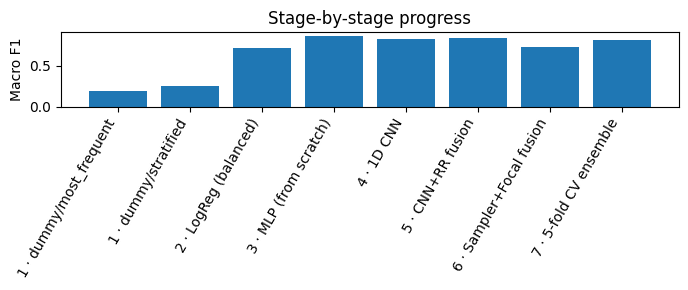
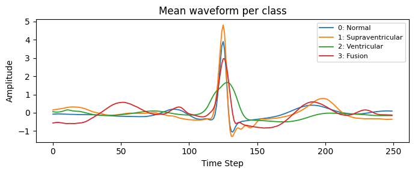
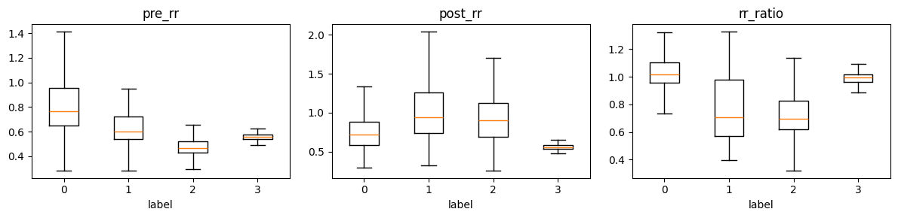
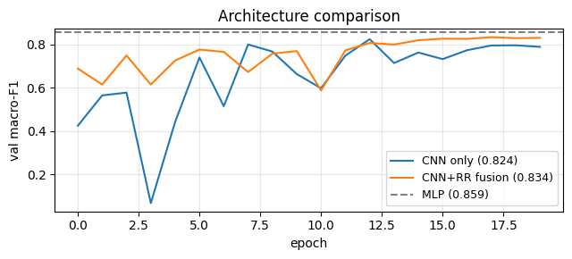

# ECG Heartbeat Arrhythmia Classification

Classifying single ECG heartbeats into four clinically meaningful rhythm categories with PyTorch models **trained entirely from scratch** (no pre-trained weights). Built for a Kaggle competition in the IIT Madras *Deep Learning and Generative AI* course (NPPE 2); evaluated with **Macro F1**.

<p align="center"></p>

## Problem

Each row is one heartbeat cut from a real hospital ECG recording:

- `sig_0 … sig_249` — 250-sample waveform window centred on the beat
- `pre_rr`, `post_rr`, `rr_ratio` — timing to the previous / next beat (some values missing)
- `label` — one of 4 classes

| Label | Class | Share of train |
|---|---|---|
| 0 | Normal | ~63% |
| 1 | Supraventricular ectopic | ~5% |
| 2 | Ventricular ectopic | ~31% |
| 3 | Fusion | ~0.8% |

Because Fusion beats are so rare, accuracy is misleading (a model that always predicts "Normal" is ~63% accurate); **Macro F1** weights all four classes equally.

## Approach

The project follows an iterative roadmap, adding one idea at a time and measuring its effect.

| Stage | Model | Idea |
|---|---|---|
| 1 | Dummy classifiers | Floor for Macro F1 |
| 2 | Logistic Regression | Class-balanced linear baseline |
| 3 | MLP | Fully connected net on signal + RR features |
| 4 | 1D CNN | Learn waveform morphology from the raw signal |
| 5 | **Fusion CNN** | CNN branch (waveform) + MLP branch (RR features), concatenated |
| 6 | Sampler + Focal loss | Tackle class imbalance |
| 7 | 5-fold CV ensemble | Stratified CV, soft-vote over fold models |

Shared choices: median imputation + standardisation fitted on training rows only, class-weighted cross-entropy, AdamW with a OneCycle schedule, stratified splits.

<p align="center">
  
  
</p>

*Left: mean waveform per class. Right: RR-interval features by class — ectopic beats arrive early (low `rr_ratio`), which makes these three numbers strongly informative.*

## Results

Held-out 20% stratified split (14,350 beats):

| Stage | Model | Macro F1 |
|---|---|---|
| 1 | Dummy (most frequent) | 0.193 |
| 1 | Dummy (stratified) | 0.248 |
| 2 | Logistic Regression (balanced) | 0.714 |
| 3 | MLP | 0.859 |
| 4 | 1D CNN (signal only) | 0.824 |
| 5 | Fusion CNN (signal + RR) | 0.834 |
| 6 | Fusion CNN + sampler + focal loss | 0.723 |

Stages 3–6 report the **best epoch on the validation split**, which is slightly optimistic because the epoch is chosen using the same data it is scored on.

**5-fold cross-validation (Fusion CNN, out-of-fold, final epoch): Macro F1 = 0.811** (folds: 0.809, 0.820, 0.801, 0.816, 0.811; mean 0.811 ± 0.006). This is the number I would trust most.

Kaggle leaderboard score: _<add your score here>_

### Observations

- RR-interval features carry a lot of signal: a linear model on all features already reaches ~0.71 Macro F1.
- The rare **Fusion** class dominates the error. Its F1 stays well below the other three classes in every model, and precision/recall trade off sharply (see the notebook's per-class reports).
- Adding the RR branch gave a modest gain over the signal-only CNN (0.824 → 0.834).
- Sampler + focal loss *lowered* Macro F1 in this setup. Stacking weighted sampling on top of class-weighted focal loss may over-correct for imbalance, but I did not run the ablation to confirm that.
- The plain MLP scored highest on the single split, and the CV scores of the fusion model are lower than its single-split score, so differences of a few points between models should be read with caution.

<p align="center"></p>

## Repository structure

```
├── notebooks/ecg_arrhythmia_classification.ipynb   # full experiment narrative (EDA → ensemble)
├── src/ecg/
│   ├── data.py       # loading, preprocessing, Dataset
│   ├── models.py     # SimpleMLP, CNNOnly, FusionCNN
│   ├── losses.py     # focal loss, class weights, balanced sampler
│   ├── train.py      # train / evaluate / predict loops
│   └── cv.py         # stratified K-fold + soft-vote ensembling
├── scripts/
│   ├── train.py            # single train/val run
│   └── cross_validate.py   # 5-fold CV, writes submission.csv
├── docs/figures/     # plots used in this README
└── requirements.txt
```

## Quickstart

```bash
git clone https://github.com/<your-username>/ecg-arrhythmia-classification.git
cd ecg-arrhythmia-classification
python -m venv .venv && source .venv/bin/activate
pip install -r requirements.txt
```

The dataset belongs to the course competition and is not redistributed here. Download `train.csv` and `test.csv` from the Kaggle competition page (`nppe-2-t-2-26-ecg-heartbeat-arrhythmia-classification`) into `./data/`.

```bash
# single model, 80/20 split
python scripts/train.py --model fusion --epochs 20 --data-dir data
python scripts/train.py --model fusion --imbalance sampler_focal      # stage 6 variant

# 5-fold CV + soft-vote ensemble -> results/submission.csv
python scripts/cross_validate.py --model fusion --folds 5 --epochs 15
```

Or open the notebook (it also runs unchanged on Kaggle).

## Limitations & next steps

- Single dataset and a random beat-level split; if beats from the same patient appear in both train and validation, scores can be inflated. Patient-level splitting would be a stronger test (needs patient IDs).
- Try per-class threshold tuning or a dedicated model for the Fusion class.
- Run a proper imbalance ablation (sampler only vs. focal only vs. both).
- Add data augmentation for waveforms (jitter, scaling, small time shifts) and compare deeper 1D architectures (e.g. residual blocks).

## License

MIT — see [LICENSE](LICENSE).
